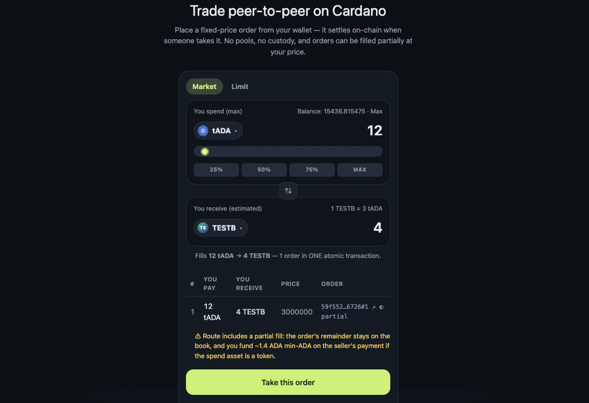

<div align="center">

# 🔆 Beacon DEX

### Peer-to-peer trading on Cardano — non-custodial, self-hosted, no middleman.

[](LICENSE)
[](.github/workflows/ci.yml)
[](package.json)
[](docker-compose.yml)
[](docs/user-guide.md)



**[Quick Start](#-quick-start)** · **[How It Works](#%EF%B8%8F-how-it-works)** · **[Docs](#-docs)** · **[Security](#%EF%B8%8F-security-warnings)** · **[Contributing](#-contributing)**

</div>

---

A peer-to-peer, order-book style trading DApp on Cardano, built on the
**distributed-DApp / beacon-token** pattern (CIP-0089, fallen-icarus style).
Every order is its own on-chain UTxO — no pools, no liquidity providers, no
platform ever holding your funds. Run it on your own machine or server with
one command; your browser wallet signs everything.

> [!NOTE]
> **Status: protocol v3 (opt-in partial fills) implemented, preprod only,
> NOT externally audited.** All local validation passes (130 Aiken tests, 120
> backend tests, 66 frontend tests, full typecheck + builds). Live preprod
> smoke tests passed for v1 (create/take/cancel), v2 (many orders taken
> atomically in one tx) and v3 (partial fill → continuation → final fill, and
> mixed partial+full batches). An in-repo adversarial security audit
> ([Audit/](Audit/security-audit-fable5.md), 2026-07-13) found the on-chain
> trust boundary strong and **no way to steal locked value**; its one High
> finding (F-01) is off-chain and gates any use beyond preprod.

## ✨ Why Beacon DEX

- 🔐 **Non-custodial** — funds sit in on-chain order UTxOs governed by
  validators; this software never sees, holds, or signs with your keys.
- 🆓 **Zero-key quick start** — defaults to [Koios](https://koios.rest), a
  free keyless Cardano API. No sign-up needed to get trading.
- 🔁 **Bring your own provider** — switch to [Blockfrost](https://blockfrost.io)
  anytime from the in-app **Settings** page, no restart required.
- ⚛️ **Atomic batch fills** — take up to 8 orders in one transaction; smart
  fill routes a single spend/receive amount across the cheapest orders.
- 🧩 **Opt-in partial fills** — sellers choose whether their order can be
  partially taken, with the remainder recreated on the book automatically.
- 📈 **Built-in arbitrage scanner** — detects profitable cycles across the
  open book, executable in a single transaction.
- 🐳 **One command to run** — `./ship.sh` or `docker compose up`, on your
  laptop or a home server.

<details>
<summary>📋 Table of contents</summary>

- [Why Beacon DEX](#-why-beacon-dex)
- [What this is / is not](#-what-this-is--is-not)
- [How it works](#%EF%B8%8F-how-it-works)
- [Repository layout](#%EF%B8%8F-repository-layout)
- [Quick Start](#-quick-start)
- [Develop / validate](#%EF%B8%8F-develop--validate)
- [How signing works](#-how-signing-works-and-why-this-is-non-custodial)
- [Security warnings](#%EF%B8%8F-security-warnings)
- [Docs](#-docs)
- [Contributing](#-contributing)
- [License](#-license)

</details>

## 🧭 What this is / is not

| It is | It is not |
|---|---|
| A P2P order book: every order is its own UTxO | An AMM / liquidity-pool DEX |
| Non-custodial: funds sit in order UTxOs governed by on-chain validators | A platform that ever holds user funds |
| Beacon tokens make orders discoverable on-chain | An off-chain order book |
| Browser wallet (CIP-30) signs every transaction | A backend that ever sees a private key |
| Fixed spot orders: create / cancel / take, batched atomically | Market-maker two-way orders, UpdateOrder |
| **Opt-in** partial fills (seller sets `allowPartialFill`) | Forced partial fills — full-fill-only orders stay full-fill-only |
| **Cardano preprod only** | Mainnet (blocked by boot guards, badges, policy, and the F-01 audit finding) |

## ⚙️ How it works

A user creates an order by locking the offered asset + a ~3.5 tADA deposit +
five **beacon tokens** in a UTxO at the order validator address (validator
payment credential + the owner's staking credential — CIP-0089 personal
addresses). Since spending validators don't run at creation, the **beacon
minting policy** enforces creation correctness: beacons only mint into
well-formed order outputs. Discovery = querying the chain for beacons.
Cancelling needs the owner's staking-key signature; **every full spend must
leave zero beacons in the tx outputs** (forcing the burn and preventing
leakage).

Three redeemers settle an order:

- **TakeOrder** (full fill) — the seller is paid exactly the asked amount plus
  the returned deposit in one exact output, and all five beacons burn.
- **TakeOrderPartial** (v3, opt-in) — a taker consumes part of the offer, pays
  `ceil(take_amount × ask / offer)`, and recreates the order as a
  **continuation** UTxO carrying the deposit, the remaining offer, all five
  beacons and the proportionally reduced datum
  ([docs/partial-fills.md](docs/partial-fills.md)).
- **CancelOrder** — the owner reclaims everything; beacons burn.

One transaction may settle **many orders atomically** (v2 **TakeManyOrders**):
each order's payment output carries an inline `PaymentTag` naming the consumed
order, so the order→payment mapping stays 1:1 and double satisfaction stays
closed ([docs/take-many-orders.md](docs/take-many-orders.md)). Two off-chain
layers build on that, with **zero contract changes**: **smart fill** routes one
intent across multiple orders ([docs/smart-fill.md](docs/smart-fill.md)), and
**arbitrage** detects profitable cycles over the open book
([docs/arbitrage.md](docs/arbitrage.md)). Full spec:
[docs/protocol-spec.md](docs/protocol-spec.md) +
[docs/mvp-contract-decisions.md](docs/mvp-contract-decisions.md).

Script identities (current build — protocol v3, aiken↔Mesh cross-checked):
`order validator 1757ecd8…6f8b`, `beacon policy c14dc44e…8702`.
Prior epochs (orders under them are orphaned, still cancellable): v2
`4d0a1335…94b8` / `a88c60a8…c9b0`, v1 `89389051…46ab` / `264ed623…cc0a`.

## 🗂️ Repository layout

```
contracts/   Aiken: order validator + beacon policy (rules in lib/, tested)
backend/     Fastify TS: Blockfrost/Koios provider (switchable in-app), beacon
             indexer, Mesh unsigned-tx builder, smart-fill + arbitrage
             planners, PostgreSQL cache (in-memory fallback for dev)
frontend/    Next.js + Mesh React: wallet connect, order book, trade/create/
             cancel/arbitrage flows with mandatory TransactionPreview
e2e/         live preprod harness: smoke tests (v1/v2/v3) + market seeding
infra/       dev docker-compose: PostgreSQL only; Kupo/Ogmios placeholders
             for the self-hosted future
docs/        user guide, development setup, protocol spec, decisions, eUTxO
             notes, beacons, security, deployment, open questions
Audit/       adversarial security audit: report, findings, regression tests

ship.sh             one-command launcher (configure → build → start)
docker-compose.yml  one-command Docker deployment (production images)
```

## 🚀 Quick Start

This app is **self-hosted by design** — nobody operates it as a service.
Clone it, run one command, trade with your own browser wallet. There's
**nothing to sign up for**: it defaults to [Koios](https://koios.rest), a
free keyless Cardano chain API, so it works out of the box. (You can switch
to [Blockfrost](https://blockfrost.io) instead, either up front or later
from the app's own **Settings** page — no restart needed.)

**One command, no Docker** (needs Node.js ≥ 20):

```bash
git clone https://github.com/SegulaLabs/P2P-swaps-cardano.git
cd P2P-swaps-cardano
./ship.sh        # first run asks which provider to use, then builds + starts
```

**Or all-Docker** (works with zero `.env` changes — Koios needs no key):

```bash
git clone https://github.com/SegulaLabs/P2P-swaps-cardano.git
cd P2P-swaps-cardano
cp .env.example .env
docker compose up --build -d  # production images + PostgreSQL cache
```

Either way: open **http://localhost:3000**, connect a CIP-30 wallet
(Eternl/Lace) set to **preprod**, funded from the official faucet
(https://docs.cardano.org/cardano-testnets/tools/faucet).

Full operating instructions, wallet setup and troubleshooting:
**[docs/user-guide.md](docs/user-guide.md)**. The version you run is shown
in the site footer and on `GET /health` ([CHANGELOG.md](CHANGELOG.md)).
Prebuilt images are published to GHCR on release tags
(`.github/workflows/release-images.yml`).

## 🛠️ Develop / validate

Contributor setup (dev servers, Aiken toolchain, contracts rebuild,
releasing): **[docs/development.md](docs/development.md)**.

```bash
npm run contracts:check   # 130 Aiken tests (aiken v1.1.23 / stdlib v2.2.0)
npm test                  # contracts + backend (120) + frontend (66)
npm run typecheck
npm run build             # backend tsc + frontend next build
```

## 🔏 How signing works (and why this is non-custodial)

1. The frontend sends your wallet's UTxOs + change address + a collateral
   UTxO to the backend, which builds and balances an **unsigned** transaction
   (coin selection uses only *your* UTxOs — the backend has none). Collateral
   is size-capped client-side and excluded from coin selection, since a
   collateral input can't also be spent (docs/eutxo.md §9).
2. You see a `TransactionPreview` with un-hidable warnings; nothing is signed
   until you explicitly confirm.
3. Your CIP-30 wallet signs and submits. The backend never sees a key — it
   refuses to boot if key-material env vars exist at all.
4. Settlement rules (exact payment, deposit return, beacon burn, continuation
   correctness, owner-only cancel) are enforced by the **on-chain validators**,
   not by the backend: a malicious backend cannot steal *from the seller* of an
   order — but see F-01 below for what it can still do to **you, the signer**.

## ⚠️ Security warnings

- **Experimental MVP. Not externally audited. Preprod only — never use
  mainnet funds.**
- **F-01 (High, from [Audit/](Audit/security-audit-fable5.md)):** the preview
  is *backend-provided* — only the fee is decoded from the real transaction.
  A malicious or compromised backend can show a benign summary while the
  actual tx routes **your own** funds elsewhere. The validators protect the
  *seller's* payment, not the party who signs. Independent client-side CBOR
  decoding is not implemented yet (docs/open-questions.md #27). **Read your
  wallet's own display before signing.**
- Lower-severity audit findings (order-book spam via unbounded ask assets,
  UI-level owner impersonation, self-fills in the route planners) are
  griefing/hygiene issues — see the report and
  [Audit/regression-tests/](Audit/regression-tests/README.md).
- The chain is the source of truth; the order book is a cache. Two takers can
  race for one order — the loser's tx fails harmlessly.
- Mainnet is out of scope until the gate in [docs/security.md](docs/security.md)
  §5 (tests ✅, live preprod ✅, F-01 closed ❌, external audit ❌, adversarial
  soak ❌) is fully passed.

## 📚 Docs

[user-guide](docs/user-guide.md) ·
[development](docs/development.md) ·
[protocol-spec](docs/protocol-spec.md) ·
[mvp-contract-decisions](docs/mvp-contract-decisions.md) ·
[eutxo](docs/eutxo.md) · [beacons](docs/beacons.md) ·
[security](docs/security.md) · [deployment](docs/deployment.md) ·
[smart-fill](docs/smart-fill.md) · [take-many-orders](docs/take-many-orders.md) ·
[partial-fills](docs/partial-fills.md) · [arbitrage](docs/arbitrage.md) ·
[open-questions](docs/open-questions.md) ·
[security audit](Audit/security-audit-fable5.md)

## 🤝 Contributing

Issues and PRs are welcome — see [CONTRIBUTING.md](CONTRIBUTING.md) for dev
setup (same as [docs/development.md](docs/development.md)) and what to
include in a PR. Found a security issue? Please read
[SECURITY.md](SECURITY.md) instead of opening a public issue.

## 📄 License

[MIT](LICENSE).
